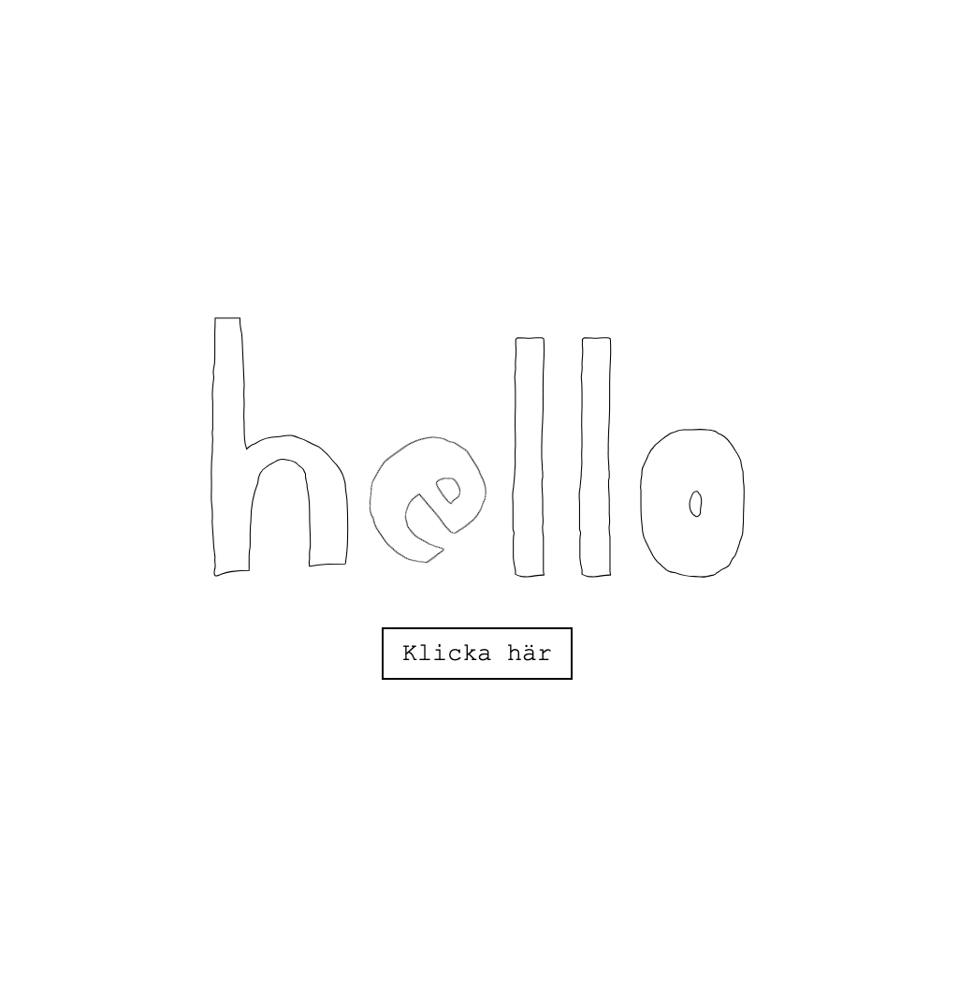
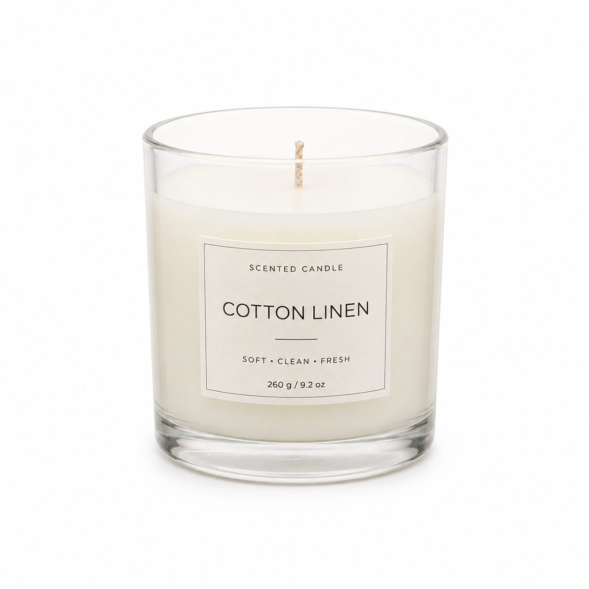

# Ett litet projekt
https://ngeliecode.github.io/cat-animation/ 👈 anpassat till desktop

## 🎬 Preview

## 🤖 AI genererad bild
Denna bild kan användas som en placeholder för en produktbild. En webbshop som säljer doftljus till exempel.

